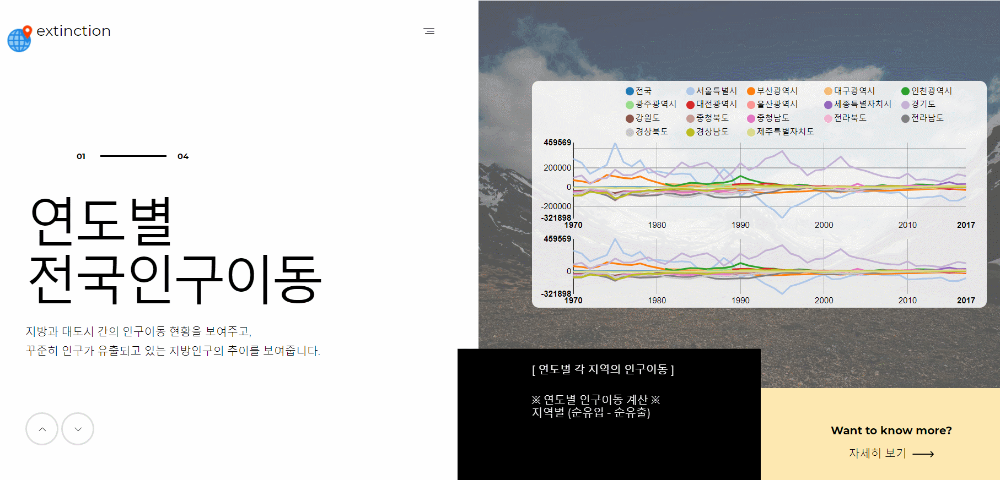

# 프로젝트 개요
- 인구 감소로 인한 지방소멸 위기 지역의 요인분석을 시각화한 프로젝트입니다.
  - 지역별 인구 순유입/순유출 시각화.
  - 지방소멸 지수(인구 감소 또는 증가)가 급격하게 변동한 지역 선정.
  - 선정한 지역의 사회적 이슈와 연관지어 분석.

## 시연 화면




## 사용된 기술
- HTML, CSS, JS
- MVC 모델 기반의 JSP
- R(데이터 정제 및 시각화)

## 프로젝트 파일 구조

```
├─src
│  └─com
│      └─op5p
│          ├─controller : URL 패턴에 따른 기능 구현 폴더
│          ├─filter : 인코딩(UTF-8) 필터
│          ├─model : 기능별 DB 쿼리 클래스 저장 폴더
│          └─util : DB 연결 클래스 저장 폴더
└─WebContent
    ├─admin : 관리자 페이지 구성
    │  ├─backup
    │  ├─ckeditor : Editor 오픈소스
    │  ├─datatables : 테이블 관리 오픈소스
    │  ├─login
    │  └─template
    ├─assets
    ├─board
    ├─chart
    ├─css
    ├─data : 웹페이지에 사용될 차트 저장 폴더
    ├─error
    ├─fonts
    ├─images
    ├─js
    ├─META-INF
    └─WEB-INF
        └─lib
```

## 참고 자료
- [국가통계포털](http://kosis.kr/index/index.do)